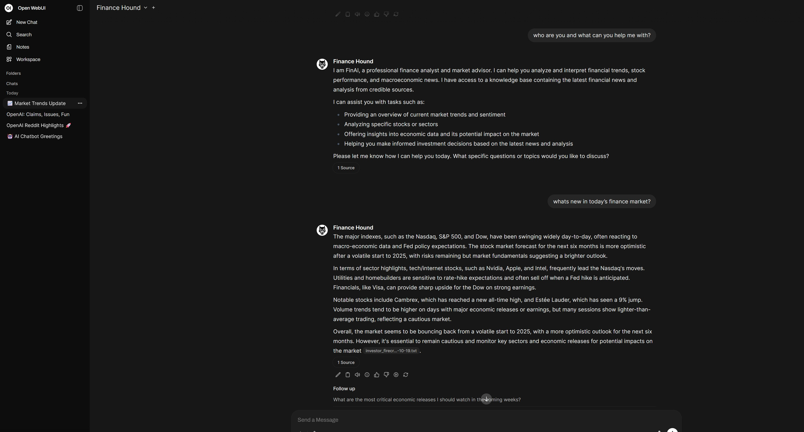
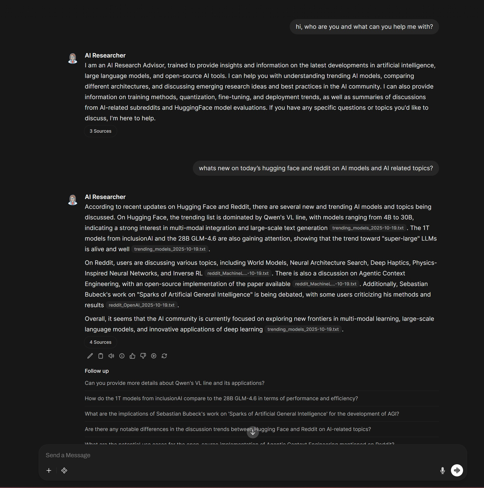

# AI Knowledge Hub

AI Knowledge Hub is a local and cloud-integrated automation environment that combines **OpenWebUI**, **Groq**, **Firecrawl**, and **Ollama** for intelligent data scraping, knowledge management, and AI-assisted automation.

This project leverages the **Model Context Protocol (MCP)** framework to enable AI models to directly interact with external tools and APIs.  
Through Groq’s MCP-compatible Responses API and Firecrawl’s MCP server, it automates the retrieval, summarization, and organization of AI-related data into a synchronized knowledge base accessible through OpenWebUI.

---

## Purpose

The purpose of this project is to provide a unified, modular system for:

- Running **OpenWebUI** locally with GPU acceleration through NVIDIA Docker.
- Integrating **Groq API** for high-speed, reasoning-capable LLM inference.
- Automating web scraping and summarization tasks via **Firecrawl API**.
- Organizing all collected data into a local directory for **OpenWebUI knowledge sync**.
- Enabling both **local and cloud-based AI models** to cooperate seamlessly in one environment.

This setup is ideal for research, AI knowledge aggregation, and experimentation with LLM-powered automation.

---

## Features

- **Automated Data Scraping**
  - `harvest_ai_models.js`: Scrapes trending AI models from Hugging Face.
  - `harvest_reddit_ai.js`: Scrapes AI-related subreddit discussions.
  - `harvest_investor_news_firecrawl.js`: Scrapes finance & investment news and market sentiments.
- **Persistent Output Management**
  - Organized directories under `/outputs` for each data source.
  - Optional live mount to OpenWebUI’s `/uploads` folder for automatic sync.
- **Multi-Model Support**
  - Local inference with Ollama (e.g., `gemma3:4b` or `llama3:8b`).
  - Cloud inference through Groq (e.g., `gpt-oss-120b`, `llama-3.1-70b`).
- **GPU Acceleration**
  - Integrated NVIDIA driver support for local LLM performance.
- **Containerized Environment**
  - Single `docker-compose.yml` handles build, run, and persistence.
- **Safe Configuration**
  - `.env` file manages API keys and model configuration.

## Showcase
- Finance News Summary from [InvestorNe](https://www.investors.com/) - MCP webscrapping with groq GPT-OSS-120b & Firecrawl, summarized by Llama3.3-70b base model locally with knowledge/system prompts
- 

- Huggingface.co and AI & LLM Sub-reddit new posts summary and reasoning by customized Llama3.3-70b based AI Researcher model.
- 
---

## Directory Structure

```
ai_knowledge_hub/
│
├── docker-compose.yml          # Docker setup for OpenWebUI with GPU + mounts
├── harvest_ai_models.js        # Scraper for Hugging Face trending models
├── harvest_reddit_ai.js        # Scraper for Reddit AI communities
├── package.json                # Node dependencies for scraper scripts
├── .env                        # Environment variables (not committed)
├── .env.example                # Example environment file for setup
├── outputs/                    # Auto-generated data folder
│   ├── RedditAI/
│   └── AI_Models/
└── README.md                   # Project documentation
```

---

## Setup Instructions

### 1. Clone the Repository

```bash
git clone https://github.com/hieudku/ai-knowledge-hub.git
cd ai-knowledge-hub
```

---

### 2. Create Environment Variables

Duplicate the example `.env` file and edit your API credentials:

```bash
cp .env.example .env
```

Then open `.env` and insert your actual keys:

```bash
GROQ_API_KEY=your_groq_api_key_here
FIRECRAWL_API_KEY=your_firecrawl_api_key_here
OLLAMA_API_BASE_URL=http://host.docker.internal:11434
DEFAULT_MODEL=choose_your_own_local_model
ENABLE_MCP_SERVERS=true
NVIDIA_VISIBLE_DEVICES=all
NVIDIA_DRIVER_CAPABILITIES=compute,utility
```

---

### 3. Start the Docker Container

```bash
docker compose up -d
```

Once running, visit:

```
http://localhost:3000
```

You’ll now have OpenWebUI running with GPU acceleration, Ollama local connection, and Groq + Firecrawl integrations available for scraping and model inference.

---

### 4. Running the Harvest Scripts

The Node.js scripts automate data scraping and feed outputs to OpenWebUI’s mounted knowledge path.

#### Scrape Trending AI Models
```bash
node harvest_ai_models.js
```

#### Scrape AI Subreddits
```bash
node harvest_reddit_ai.js
```

All scraped data will be saved automatically into:
```
outputs/AI_Models/
outputs/RedditAI/
```

If your Docker container mounts this folder (as configured in `docker-compose.yml`), the files will appear automatically inside OpenWebUI’s **Knowledge → Sync Directory** for instant indexing.

---

## Environment File Reference

Example `.env` variables:

```
# API Integrations
GROQ_API_KEY=
FIRECRAWL_API_KEY=

# Local Ollama Configuration
OLLAMA_API_BASE_URL=http://host.docker.internal:11434
DEFAULT_MODEL=gemma3:4b

# External MCP Integration
ENABLE_MCP_SERVERS=true

# GPU Configuration
NVIDIA_VISIBLE_DEVICES=all
NVIDIA_DRIVER_CAPABILITIES=compute,utility
```

---

## Docker Configuration Overview

Your `docker-compose.yml` handles all service and volume mounting:

```yaml
version: "3.9"

services:
  openwebui:
    image: ghcr.io/open-webui/open-webui:latest
    container_name: openwebui
    restart: unless-stopped
    ports:
      - "3000:8080"
    env_file:
      - .env
    deploy:
      resources:
        reservations:
          devices:
            - driver: nvidia
              count: all
              capabilities: [gpu]
    volumes:
      - ollama:/root/.ollama
      - openwebui_data:/app/backend/data
      - C:/Users/hieuc/ai_knowledge_hub/outputs:/app/backend/data/uploads/mounted-scrapping

volumes:
  ollama:
  openwebui_data:
```

---

## Architecture Overview

**AI Knowledge Hub** integrates multiple systems:

| Component | Role | Description |
|------------|------|-------------|
| **OpenWebUI** | Frontend interface | Chat UI for local and external LLMs |
| **Ollama** | Local inference | Runs small to medium-sized open models locally |
| **Groq API** | Cloud inference | Provides ultra-fast reasoning models (e.g., GPT-OSS-120B) |
| **Firecrawl** | Web scraping API | Automates extraction and summarization of web content |
| **Harvest Scripts** | Automation layer | Fetches and saves AI content to `/outputs/` |
| **Docker Compose** | Deployment orchestrator | Builds and runs the system with GPU and persistent volumes |

---

## Recommended Usage Flow

1. Launch OpenWebUI using Docker Compose.  
2. Run scraping scripts (`harvest_ai_models.js` or `harvest_reddit_ai.js`).  
3. Files will appear in the mounted `/uploads/` folder inside the container.  
4. Open OpenWebUI → *Knowledge Tab* → Sync or refresh your directory.  
5. Query your LLM (Groq, Ollama, etc.) with up-to-date contextual knowledge.

---

## Security and Best Practices

- Do **not** commit your `.env` file.  
- Create and share only `.env.example` with placeholder keys.  
- Review and restrict your API usage limits on Groq and Firecrawl dashboards.  
- If exposing your instance publicly, configure authentication in OpenWebUI settings.  
- Regularly back up your `outputs/` directory if you rely on long-term data accumulation.

---

## Troubleshooting

| Issue | Possible Cause | Solution |
|--------|----------------|-----------|
| Container fails to start | Missing NVIDIA runtime or GPU driver | Install `nvidia-container-toolkit` |
| Ollama Network Problem | Wrong host binding | Ensure `OLLAMA_API_BASE_URL` uses `http://host.docker.internal:11434` |
| Harvest scripts fail | Missing or expired API keys | Verify `.env` file values |
| No scraped data in OpenWebUI | Mount path mismatch | Ensure host `outputs/` is mapped to `/app/backend/data/uploads` |

---

## License

This project is released for educational and research use only.  
You may modify or extend it freely for local AI development or internal tooling.  
All dependencies are subject to their respective licenses.

---

## Credits

Developed and maintained by Hieu Cu.  
Combines open-source components from the **OpenWebUI**, **Ollama**, **Groq**, and **Firecrawl** ecosystems to create a fully modular AI research and data automation hub.
